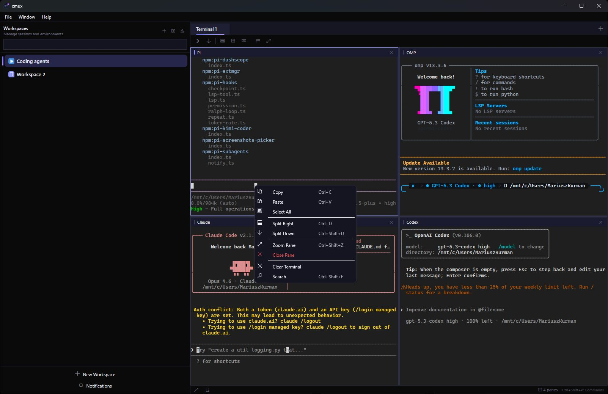
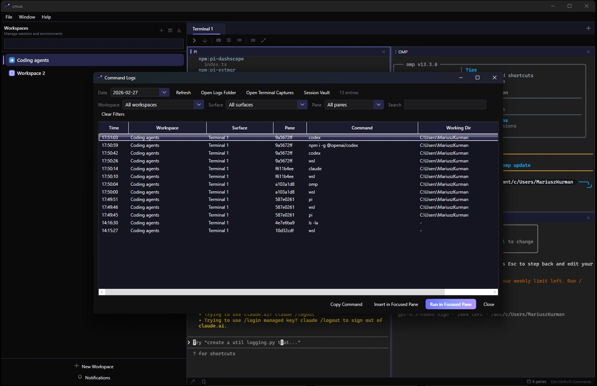
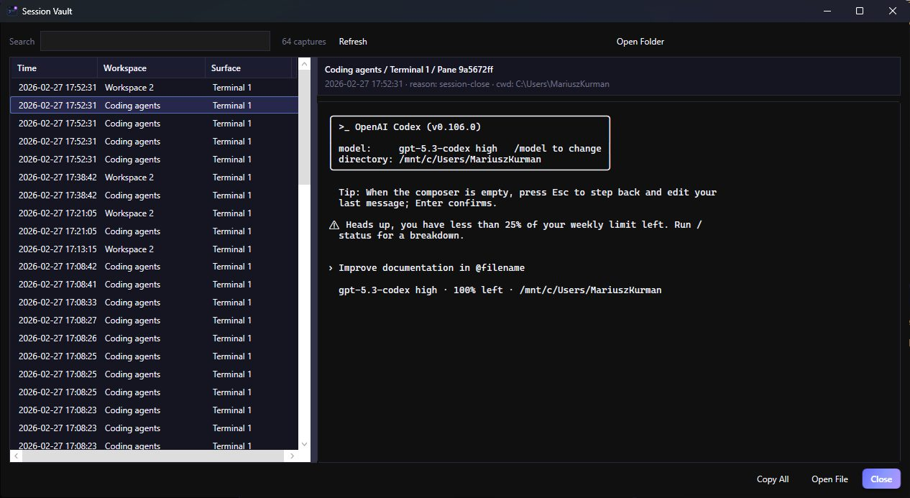

# cmuxw

Windows-native terminal multiplexer inspired by `cmux`, built with WPF + ConPTY.

## English

### Why cmuxw
- Dedicated Windows implementation (`cmux` + `windows`).
- Keyboard-first multiplexer with workspaces, surfaces, split panes.
- Session/log tooling for daily engineering workflows.

### Screenshots




### Quick start
```powershell
git clone https://github.com/scokeepa/cmuxw.git
cd cmuxw
dotnet build Cmux.sln -c Debug
dotnet run --project src/Cmux/Cmux.csproj -c Debug
```

### Command compatibility policy
- App/repository/product name: **cmuxw**
- CLI command namespace: **cmux** (kept intentionally for upstream compatibility)

```powershell
cmux workspace list
cmux workspace create --name "My Project"
cmux pane list
cmux split right
cmux status
```

#### Orchestrator-focused compatibility additions
- `cmux tree --all [--json]`
- `cmux identify`
- `cmux capture-pane [--scrollback] [--lines N]`
- `cmux set-buffer` / `cmux paste-buffer`
- `cmux display-message`
- `cmux claude-hook`
- `cmux log`
- `cmux browser screenshot`

Details and output contracts: [`docs/CLI_COMPAT.md`](docs/CLI_COMPAT.md)

### Browser surfaces (WebView2 + Playwright)
- **UI**: click the globe icon in the top toolbar, or use `File > New Browser`, or press `Ctrl+Shift+B`.
- **CLI**:

```powershell
cmux browser open https://github.com/manaflow-ai/cmux
cmux browser list
cmux browser snapshot
```

### Build
```powershell
dotnet publish src/Cmux/Cmux.csproj -c Release -r win-x64 --self-contained false -o publish/cmux-win-x64
dotnet publish src/Cmux.Cli/Cmux.Cli.csproj -c Release -r win-x64 --self-contained true -o publish/cmux-cli
```

### Theme support
- **Dark mode** (default): Cursor-style deep darks — chrome `#1E1E1E`, sidebar `#181818`, text `#CCCCCC`.
- **Light mode**: chrome/sidebar `#F3F3F3`, terminal pane `#F8F8F8`, input fields `#FFFFFF`, text `#383A42`.
- Toggle with the sun/moon button in the sidebar footer, or change in Settings > Appearance > Theme.

### Explorer updates
- Add root now uses a native folder picker dialog.
- Sidebar header/filter layout is unified between Workspaces and Explorer tabs.
- Drag-and-drop from Explorer to terminal inserts file/folder paths.
- Explorer node context menu is generated at right-click time for stable behavior.
- Context menu labels are localized (Korean/Chinese/English) including `Delete`.

### Releases
```powershell
.\release.ps1 -Tag v0.1.4 -AssetPath publish/cmuxw-win-x64.zip
.\release.ps1 -Tag v0.1.4 -AssetPath publish/cmuxw-win-x64.zip -UpdateExisting
```

Release notes history: [`CHANGELOG.md`](CHANGELOG.md)

---

## 한국어

### cmuxw 소개
- `cmux + windows`를 결합한 Windows 전용 터미널 멀티플렉서입니다.
- 워크스페이스/서피스/분할 패널 기반의 키보드 중심 UX를 제공합니다.
- 명령 로그, 세션 보관함 등 운영 기능을 포함합니다.

### 빠른 시작
```powershell
git clone https://github.com/scokeepa/cmuxw.git
cd cmuxw
dotnet build Cmux.sln -c Debug
dotnet run --project src/Cmux/Cmux.csproj -c Debug
```

### 명령어 호환성 정책
- 저장소/앱 이름은 **cmuxw**
- CLI 명령어는 상위 호환성을 위해 **cmux**를 유지

```powershell
cmux workspace list
cmux pane list
cmux split right
```

#### Orchestrator 연동용 추가 호환 명령
- `cmux tree --all [--json]`
- `cmux identify`
- `cmux capture-pane [--scrollback] [--lines N]`
- `cmux set-buffer` / `cmux paste-buffer`
- `cmux display-message`
- `cmux claude-hook`
- `cmux log`
- `cmux browser screenshot`

세부 출력 계약과 검증 스냅샷: [`docs/CLI_COMPAT.md`](docs/CLI_COMPAT.md)

### 브라우저 서피스 (WebView2 + Playwright)
- **UI**: 상단 툴바의 지구본 아이콘 클릭, `파일 > 새 브라우저`, 또는 `Ctrl+Shift+B`.
- **CLI**:

```powershell
cmux browser open https://github.com/manaflow-ai/cmux
cmux browser list
cmux browser snapshot
```

### Explorer 업데이트
- 루트 추가는 수동 입력 대신 폴더 선택 다이얼로그를 사용합니다.
- Workspaces/Explorer 탭 전환 시 상단 필터/액션 레이아웃이 동일하게 유지됩니다.
- 탐색기에서 터미널로 드래그 앤 드롭 시 경로를 바로 삽입할 수 있습니다.
- 우클릭 시점에 컨텍스트 메뉴를 동적 생성해 메뉴 동작 안정성을 높였습니다.
- 컨텍스트 메뉴 라벨(`Delete` 포함)은 다국어(한/중/영)로 반영됩니다.

### 협업/문서
- 기여 가이드: [`CONTRIBUTING.md`](CONTRIBUTING.md)
- CLI 호환성 문서: [`docs/CLI_COMPAT.md`](docs/CLI_COMPAT.md)
- 이슈/PR 템플릿 활성화

## License
MIT
